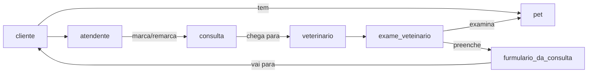
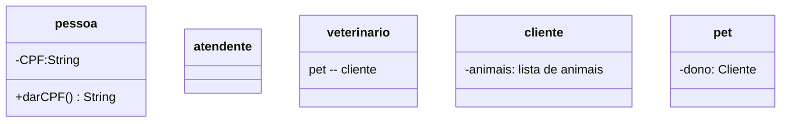

# trabalho-engenharia-software-2026
Trabalho de clínica veterinária do Técnico em Informática, segundo semestre de 2026.
https://www.figma.com/design/tfM8Nz7j2IhWiDiP5KNTXz/Sem-t%C3%ADtulo?node-id=0-1&m=dev&t=8ET3fFTOcIBfyKrZ-1

##Diagramas UML
###Diagrama de caso de uso

###Diagrama de classe

